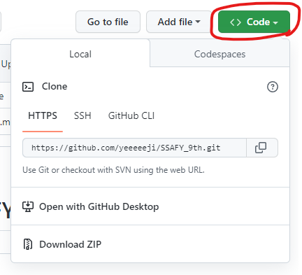
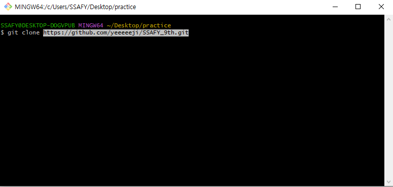
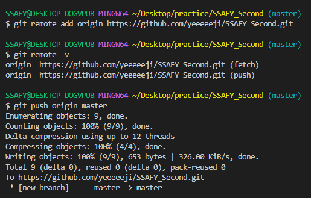
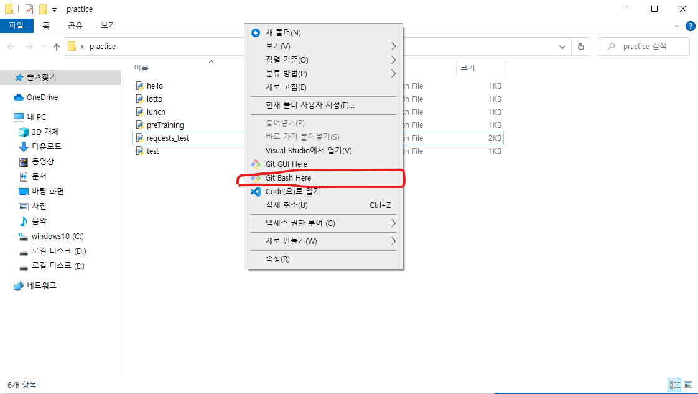

# Git

### 2023.01.12

git: 분산 버전 관리 프로그램

- 버전: 컴퓨터 소프트웨어의 특정 상태
- 관리: 어떤 일의 사무, 시설이나 물건의 유지/개량
- 프로그램: 컴퓨터에서 실행될 때 특정 작업을 수행하는 일련의 명령어들의 모임
- 버전관리 → 최종, 최최종, 최최최종
- 분산 → local이 아닌 서버에 저장

<aside>
💡 gmail로 가입하면 좋음
닉네임은 이름을 이용해서

</aside>

- .gitignore

- README.md

- Repository
  
  - 특정 디렉토리를 버전 관리하는 저장소

<aside>
💡 붙여넣기: shift + insert

</aside>

<aside>
💡 .git → git에 대한 정보가 들어있는 곳. 버전 관리에 필요한 모든 것이 들어있음
repository 안에 또 repository를 클론하면 실행안됨!

</aside>

새로운 파일을 만들 때

- GUI

- CLI (Command Line Interface)

GUI는 CLI에 비해 사용하기 쉽지만 컴퓨터의 성능을 더 소모

<aside>
💡 touch: 파일을 생성하는 명령어
Mkdir: 새 폴더를 생성하는 명령어
…

</aside>

- local에서 발생

**Working Directory** —————————— **Staging Area** ——————————— **Repository**

                                            git add                                               git commit
    
    untracked file                                             tracked file
    
          git init

내가 작업하고 있는 실제 디렉토리

커밋으로 남기고 싶은, 특정 버전으로 관리하고 싶은 파일이 있는 곳

커밋들이 저장되는 곳

- local에서 시작할 때

<aside>
💡 $ git push **-u** origin master → 앞으로 계속 master 브랜치에 push 하겠다

</aside>

- server에서 시작할 때

<aside>
💡 git clone {주소}

</aside>

<aside>
⭐ **Git 명령어**

- 서버에서 시작
  git clone 리모트 레파지토리 주소
- 로컬에서 시작
  git init
  git remote add origin 리모트 레파지토리 주소

git add 파일 이름 / git add .
git commit -m “메세지”

git push origin master(브랜치명) / git push -u origin master → git push
git pull

</aside>
